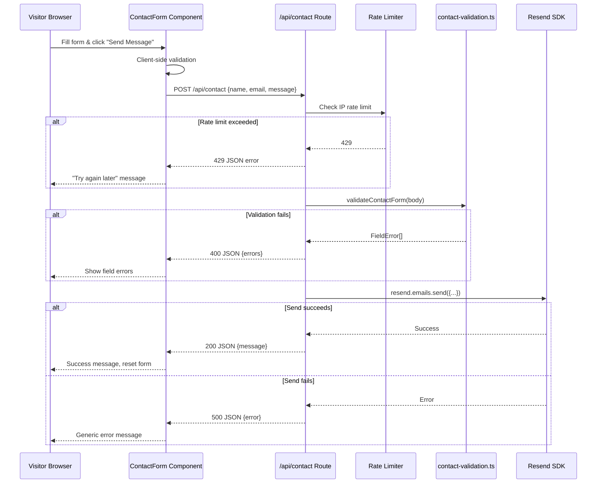

# Design Document: Contact Email Service

## Overview

This feature replaces the existing mailto-based contact form with a server-side email delivery system. The current `ContactForm` component opens the visitor's email client via a `mailto:` link. The new implementation submits form data to a Next.js API route (`/api/contact`) which validates the input and delivers the email via the Resend SDK.

**Key architectural change:** The project currently uses `output: "export"` (static HTML export) in `next.config.ts`. Since API routes require server-side execution, the configuration must switch to standard Next.js deployment (removing `output: "export"`). This enables the App Router route handler at `src/app/api/contact/route.ts`.

### Design Decisions

1. **Resend as email provider** — Lightweight SDK, generous free tier (100 emails/day), simple API, and good TypeScript support.
2. **In-memory rate limiter** — Simple `Map<string, {count, timestamp}>` per serverless instance. Acceptable for a portfolio site with low traffic; no external store needed.
3. **Reuse existing validation** — `contact-validation.ts` already exports `validateContactForm()`. The API route imports it directly, ensuring client and server validation stay in sync.
4. **App Router route handler** — Uses `src/app/api/contact/route.ts` with the exported `POST` function convention, which is the standard pattern for Next.js App Router.

## Architecture



## Components and Interfaces

### 1. API Route Handler — `src/app/api/contact/route.ts`

```typescript
// Exported function for App Router route handler
export async function POST(request: Request): Promise<Response>
```

Responsibilities:
- Parse JSON request body
- Extract client IP from headers (`x-forwarded-for` or `x-real-ip`)
- Check rate limit
- Validate input using `validateContactForm()`
- Send email via Resend SDK
- Return appropriate HTTP response

### 2. Rate Limiter — `src/lib/rate-limiter.ts`

```typescript
export interface RateLimitEntry {
  count: number;
  resetTime: number; // Unix timestamp (ms)
}

export interface RateLimitResult {
  allowed: boolean;
  remaining: number;
  resetTime: number;
}

export function checkRateLimit(
  ip: string,
  maxRequests?: number,  // default: 5
  windowMs?: number      // default: 15 * 60 * 1000
): RateLimitResult;
```

Uses a module-level `Map<string, RateLimitEntry>` for storage. Entries are lazily cleaned when checked.

### 3. Email Sender — `src/lib/email-sender.ts`

```typescript
export interface SendContactEmailParams {
  name: string;
  email: string;
  message: string;
  toAddress: string;
}

export interface SendEmailResult {
  success: boolean;
  error?: string;
}

export async function sendContactEmail(
  params: SendContactEmailParams
): Promise<SendEmailResult>;
```

Wraps the Resend SDK call. Isolates the third-party dependency for testability.

### 4. Updated ContactForm Component — `src/components/ContactForm.tsx`

Modifications to the existing component:
- Replace `mailto:` logic with `fetch('/api/contact', { method: 'POST', ... })`
- Add `isSubmitting` state for loading indicator
- Add `submitResult` state (`'success' | 'error' | null`) for feedback
- Disable submit button during submission
- Reset form fields on success

### 5. Existing Validation — `src/lib/contact-validation.ts`

No changes required. Already exports `validateContactForm()`, `ContactFormData`, and `FieldError` types used by both client and server.

## Data Models

### Request Payload

```typescript
// POST /api/contact request body
interface ContactRequest {
  name: string;    // 1–100 chars, at least one non-whitespace
  email: string;   // 1–254 chars, valid email format
  message: string; // 1–2000 chars, at least one non-whitespace
}
```

### Response Payloads

```typescript
// Success response (200)
interface ContactSuccessResponse {
  message: string;
}

// Validation error response (400)
interface ContactValidationErrorResponse {
  error: string;
  errors: FieldError[];
}

// Generic error response (400 | 405 | 429 | 500)
interface ContactErrorResponse {
  error: string;
}
```

### Rate Limit Store (in-memory)

```typescript
// Module-level Map
const store: Map<string, RateLimitEntry> = new Map();

interface RateLimitEntry {
  count: number;
  resetTime: number; // Date.now() + windowMs at first request
}
```

### Environment Variables

| Variable | Purpose | Required |
|----------|---------|----------|
| `RESEND_API_KEY` | Resend API authentication key | Yes |
| `CONTACT_EMAIL_TO` | Recipient email for form submissions | Yes |


## Correctness Properties

*A property is a characteristic or behavior that should hold true across all valid executions of a system — essentially, a formal statement about what the system should do. Properties serve as the bridge between human-readable specifications and machine-verifiable correctness guarantees.*

### Property 1: Email construction preserves all input fields

*For any* valid `ContactFormData` (name with ≥1 non-whitespace char and ≤100 chars, email matching pattern and ≤254 chars, message with ≥1 non-whitespace char and ≤2000 chars), when submitted to the API route, the email sent via Resend SHALL contain the visitor's name, email address, and message in the body, and the `replyTo` field SHALL equal the visitor's email address.

**Validates: Requirements 1.1, 1.3, 1.4**

### Property 2: Route validation is equivalent to validateContactForm

*For any* `ContactFormData` object, the API route SHALL return HTTP 400 with field errors if and only if `validateContactForm(data)` returns a non-empty error array. The error fields returned by the route SHALL match those returned by `validateContactForm`.

**Validates: Requirements 3.1, 3.2, 3.3, 3.4**

### Property 3: Error responses never expose internal details

*For any* error thrown by the Resend SDK (regardless of error type, message content, or stack trace), the API route SHALL return HTTP 500 with a response body that contains only a generic error message and does not include the original error message, stack trace, or any internal system details.

**Validates: Requirements 4.1, 4.2**

### Property 4: Rate limiter enforces window-based request throttling

*For any* IP address string and any sequence of requests, the rate limiter SHALL allow exactly 5 requests within a 15-minute window and reject all subsequent requests with `allowed: false`. After the 15-minute window elapses, the rate limiter SHALL reset and allow another 5 requests.

**Validates: Requirements 5.1, 5.2**

## Error Handling

| Scenario | HTTP Status | Response Body | Logging |
|----------|-------------|---------------|---------|
| Valid submission, email sent | 200 | `{ message: "Message sent successfully" }` | None |
| Missing/invalid fields | 400 | `{ error: "Validation failed", errors: [...] }` | None |
| Unparseable JSON body | 400 | `{ error: "Invalid request body" }` | None |
| Non-POST method | 405 | `{ error: "Method not allowed" }` | None |
| Rate limit exceeded | 429 | `{ error: "Too many requests. Please try again later." }` | None |
| Missing env vars | 500 | `{ error: "Internal server error" }` | `console.error` with details |
| Resend API failure | 500 | `{ error: "Internal server error" }` | `console.error` with Resend error |
| Unexpected exception | 500 | `{ error: "Internal server error" }` | `console.error` with error |

### Error handling principles

1. **Never expose internals** — All 500 responses use the same generic message. Detailed errors are logged server-side only.
2. **Fail fast** — Validation and rate limiting happen before the Resend call to avoid unnecessary external requests.
3. **Structured error responses** — Validation errors include the field-level `FieldError[]` array so the client can display per-field messages.

## Testing Strategy

### Property-Based Tests (fast-check, minimum 100 iterations each)

| Test File | Properties Covered |
|-----------|-------------------|
| `tests/property/contact-api-route.property.test.ts` | Property 1 (email construction), Property 2 (validation equivalence), Property 3 (error concealment) |
| `tests/property/rate-limiter.property.test.ts` | Property 4 (window-based throttling) |

**Library:** `fast-check` (already installed in the project)

**Tag format:** Each test is annotated with:
```
Feature: contact-email-service, Property {N}: {title}
```

**Configuration:** Each property test runs with `{ numRuns: 100 }`.

### Unit Tests (vitest)

| Test File | Coverage |
|-----------|----------|
| `tests/unit/api-contact-route.test.ts` | HTTP 405 for non-POST, 400 for invalid JSON, 500 for missing env vars, success path |
| `tests/unit/email-sender.test.ts` | Resend SDK wrapper: success, failure, parameter mapping |
| `tests/unit/rate-limiter.test.ts` | Edge cases: first request allowed, boundary at exactly 5, different IPs independent |

### Component Tests (testing-library/react)

| Test File | Coverage |
|-----------|----------|
| `tests/component/ContactForm.test.tsx` | Loading state, success message, error message, form reset, submit button disabled during submission |

### Integration Notes

- The Resend SDK is mocked in all unit/property tests via `vi.mock('resend')`
- The rate limiter accepts an optional `nowFn` parameter to enable deterministic time-based testing
- No real emails are sent during testing
- Environment variables are set/unset via `vi.stubEnv()` in relevant tests

### Test Organization

```
tests/
├── property/
│   ├── contact-api-route.property.test.ts    (Properties 1–3)
│   └── rate-limiter.property.test.ts         (Property 4)
├── unit/
│   ├── api-contact-route.test.ts
│   ├── email-sender.test.ts
│   └── rate-limiter.test.ts
├── component/
│   └── ContactForm.test.tsx
```
