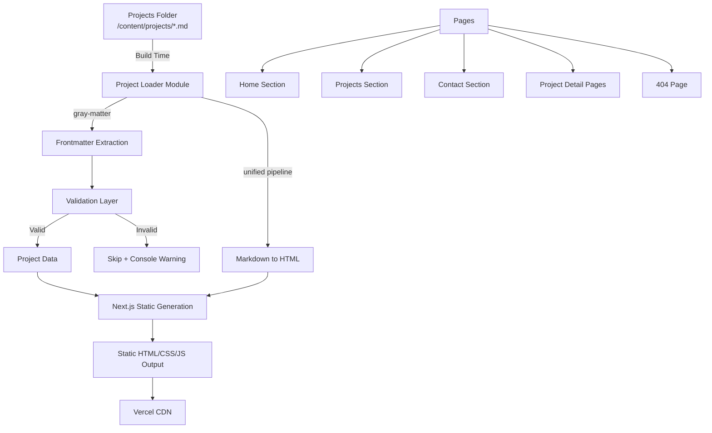

# Design Document

## Overview

This design describes a personal portfolio website for a junior full-stack developer, built with Next.js (App Router) and deployed on Vercel. The site uses file-based content management: projects are authored as markdown files with YAML frontmatter and placed in a designated folder. At build time, the system reads, validates, and renders these files into static HTML pages.

The site features a single-page layout with smooth-scrolling navigation between Home, Projects, and Contact sections, plus dynamic routes for individual project detail pages. The visual identity uses a dark theme (#262626 background, #FEFEFE text, #FF8014 accent) with JetBrains Mono typography throughout.

**Key Design Decisions:**
- **Next.js App Router** with static export (`output: 'export'`) — produces pure static files, optimal for Vercel
- **gray-matter** for frontmatter parsing — mature, widely used, handles YAML reliably
- **unified/remark/rehype** pipeline for markdown-to-HTML — extensible, standard in the Next.js ecosystem
- **Tailwind CSS** for styling — utility-first, rapid development, built-in responsive design utilities, purges unused CSS for minimal bundle size
- **mailto: link** for contact form submission — simplest approach matching the requirement, no backend needed

## Architecture

The application follows a static site generation (SSG) architecture where all pages are pre-rendered at build time.



**Architecture Layers:**

1. **Content Layer** — Markdown files with YAML frontmatter in `/content/projects/`
2. **Data Layer** — Project Loader module that reads, parses, validates, and transforms markdown content
3. **Presentation Layer** — Next.js pages and React components styled with Tailwind CSS utility classes
4. **Build Layer** — Next.js static export producing deployable assets

## Components and Interfaces

### Project Loader Module (`lib/projects.ts`)

The core data access layer responsible for reading and processing markdown files.

```typescript
// lib/projects.ts

interface ProjectFrontmatter {
  title: string;       // max 100 chars
  description: string; // max 300 chars
  tags: string[];
  date: string;        // YYYY-MM-DD format
}

interface Project {
  slug: string;              // derived from filename (without .md)
  frontmatter: ProjectFrontmatter;
  contentHtml: string;       // rendered markdown body
}

// Public API
function getAllProjects(): Project[];
function getProjectBySlug(slug: string): Project | null;
function getProjectSlugs(): string[];
```

**Responsibilities:**
- Read all `.md` files from `/content/projects/`
- Parse frontmatter with `gray-matter`
- Validate frontmatter fields (type, format, length constraints)
- Skip invalid files with a console warning
- Sort valid projects by date descending, filename ascending as tiebreaker
- Render markdown body to HTML via unified pipeline

### Frontmatter Validator (`lib/validate-frontmatter.ts`)

```typescript
interface ValidationResult {
  valid: boolean;
  errors: string[];
}

function validateFrontmatter(data: unknown): ValidationResult;
```

**Validation Rules:**
- `title`: required string, max 100 characters
- `description`: required string, max 300 characters
- `tags`: required array of strings
- `date`: required string matching `YYYY-MM-DD` format (regex + Date validity check)

### Navigation Bar Component (`components/Navbar.tsx`)

- Fixed position at viewport top using Tailwind utility classes (`fixed top-0 w-full`)
- Links: Home, Projects, Contact
- Uses `IntersectionObserver` to detect active section
- Highlights active link with accent color via conditional Tailwind class (e.g., `text-[#FF8014]`)
- Responsive: collapses to hamburger menu below 768px using Tailwind's `md:` breakpoint
- Smooth scroll via `scroll-behavior: smooth` and anchor links with `scrollIntoView`

### Contact Form Component (`components/ContactForm.tsx`)

```typescript
interface ContactFormData {
  name: string;    // max 100 chars, min 1 non-whitespace
  email: string;   // max 254 chars, pattern: local-part@domain
  message: string; // max 2000 chars, min 1 non-whitespace
}

interface FieldError {
  field: keyof ContactFormData;
  message: string;
}

function validateContactForm(data: ContactFormData): FieldError[];
```

- Client-side validation on submit
- Displays per-field error messages
- On valid submission: constructs `mailto:` link and opens it / shows confirmation
- Confirmation message displayed after submission trigger

### Project Card Component (`components/ProjectCard.tsx`)

- Displays: title, description, tags, date
- Links to `/projects/[slug]`
- Responsive: single column < 768px, multi-column grid ≥ 768px using Tailwind's grid utilities (`grid grid-cols-1 md:grid-cols-2 lg:grid-cols-3 gap-6`)

### Page Structure

| Route | Component | Data Source |
|-------|-----------|-------------|
| `/` (Home + Projects + Contact sections) | `app/page.tsx` | `getAllProjects()` |
| `/projects/[slug]` | `app/projects/[slug]/page.tsx` | `getProjectBySlug()` |
| 404 | `app/not-found.tsx` | Static |

## Data Models

### Markdown File Schema

Each project file in `/content/projects/` follows this structure:

```markdown
---
title: "Project Name"
description: "A brief description of the project."
tags: ["React", "TypeScript", "Next.js"]
date: "2025-01-15"
---

Full markdown content goes here...
```

### Internal Data Structures

```typescript
// Parsed and validated project
interface Project {
  slug: string;
  frontmatter: {
    title: string;
    description: string;
    tags: string[];
    date: string;
  };
  contentHtml: string;
}

// Contact form state
interface ContactFormState {
  values: ContactFormData;
  errors: FieldError[];
  submitted: boolean;
}
```

### File System Layout

```
/content/
  /projects/
    my-first-project.md
    another-project.md
/src/
  /app/
    page.tsx              # Home page (all sections)
    not-found.tsx         # 404 page
    layout.tsx            # Root layout (font, theme)
    globals.css           # Tailwind directives + custom base styles
    /projects/
      /[slug]/
        page.tsx          # Project detail page
  /components/
    Navbar.tsx
    ProjectCard.tsx
    ContactForm.tsx
    HeroSection.tsx
    ProjectsSection.tsx
    ContactSection.tsx
  /lib/
    projects.ts           # Project Loader
    validate-frontmatter.ts
    markdown.ts           # Unified pipeline setup
tailwind.config.ts        # Tailwind configuration (theme colors, fonts)
postcss.config.js         # PostCSS with Tailwind plugin
```


## Correctness Properties

*A property is a characteristic or behavior that should hold true across all valid executions of a system—essentially, a formal statement about what the system should do. Properties serve as the bridge between human-readable specifications and machine-verifiable correctness guarantees.*

### Property 1: Frontmatter extraction round-trip

*For any* valid frontmatter object (with title ≤ 100 chars, description ≤ 300 chars, tags as string array, and date in YYYY-MM-DD format), serializing it to YAML frontmatter in a markdown file and then parsing it with the Project Loader should produce an object with identical field values.

**Validates: Requirements 1.1, 1.2**

### Property 2: Invalid frontmatter rejection

*For any* markdown file whose frontmatter is missing a required field (title, description, tags, or date), has a field of the wrong type, or has a field violating length/format constraints, the Project Loader shall exclude it from the returned project list without throwing an error, and all other valid files in the same folder shall still appear in the output.

**Validates: Requirements 1.3**

### Property 3: Project sort ordering invariant

*For any* list of valid projects, the output of `getAllProjects()` shall be ordered such that for every consecutive pair of projects (A, B), either A.date > B.date, or (A.date === B.date and A.slug <= B.slug).

**Validates: Requirements 1.5**

### Property 4: Non-whitespace field validation

*For any* string value, the contact form validator for the name field and the message field shall accept the value if and only if it contains at least one non-whitespace character. Strings composed entirely of whitespace (including empty strings) shall be rejected.

**Validates: Requirements 4.2, 4.4**

### Property 5: Email format validation

*For any* string value, the contact form email validator shall accept the value if and only if it matches the pattern `local-part@domain` where local-part has at least one character and domain contains at least one dot with characters on both sides of it.

**Validates: Requirements 4.3**

### Property 6: Validation error completeness

*For any* contact form submission with an arbitrary combination of valid and invalid fields, the validator shall return exactly one error for each invalid field and zero errors for each valid field, such that the total error count equals the number of invalid fields.

**Validates: Requirements 4.5**

### Property 7: Date formatting produces valid human-readable output

*For any* valid date string in YYYY-MM-DD format, the date formatting function shall produce a string containing the full month name, numeric day, and four-digit year (e.g., "January 15, 2025"), and parsing that output back should correspond to the same calendar date.

**Validates: Requirements 5.3**

## Error Handling

### Build-Time Errors

| Error Condition | Handling Strategy |
|----------------|-------------------|
| Markdown file with malformed YAML | `gray-matter` throws → catch, log warning with filename, skip file |
| Missing required frontmatter field | Validation fails → log warning with filename and missing field, skip file |
| Field exceeds length constraint | Validation fails → log warning, skip file |
| Invalid date format | Validation fails → log warning, skip file |
| Empty projects folder | Return empty array → render empty projects section |
| File system read error | Let error propagate → build fails with non-zero exit code |
| Missing dependency | Build fails with non-zero exit code and npm error |

### Runtime Errors (Client-Side)

| Error Condition | Handling Strategy |
|----------------|-------------------|
| Font fails to load | CSS fallback to system monospace (`font-display: swap` with 3s timeout) |
| Invalid project slug in URL | Next.js `notFound()` → renders 404 page with back link |
| Contact form validation failure | Display inline error messages per field, prevent submission |
| JavaScript disabled | Site remains functional as static HTML; smooth scroll and form validation degrade gracefully |

### Error Message Format

Console warnings during build follow a consistent format:
```
[Project Loader] Skipping "{filename}": {reason}
```

Examples:
- `[Project Loader] Skipping "bad-project.md": missing required field "title"`
- `[Project Loader] Skipping "broken.md": invalid date format "not-a-date"`

## Testing Strategy

### Testing Framework

- **Unit tests**: Vitest (fast, native ESM support, integrates with Next.js)
- **Property-based tests**: fast-check (with Vitest as runner)
- **Component tests**: React Testing Library
- **E2E tests** (optional): Playwright for visual regression and responsive behavior

### Property-Based Testing Configuration

- Library: **fast-check** (npm package `fast-check`)
- Minimum iterations: **100 per property**
- Tag format: `Feature: developer-portfolio, Property {number}: {property_text}`
- Each correctness property maps to a single `fc.assert(fc.property(...))` call

### Test Categories

**Property-Based Tests (automated, 100+ iterations each):**
- Frontmatter round-trip preservation
- Invalid frontmatter rejection (various invalid inputs)
- Project sort ordering invariant
- Contact form non-whitespace validation
- Contact form email pattern validation
- Validation error completeness
- Date formatting correctness

**Unit Tests (example-based):**
- Navbar renders correct links (Home, Projects, Contact)
- Project card links to correct slug URL
- 404 page renders with back link
- Home page has h1 with developer name
- CTA elements have accent color and correct href
- Font fallback stack includes monospace
- Empty projects folder renders empty section

**Integration/E2E Tests:**
- Smooth scroll navigation between sections
- Responsive navbar collapses at < 768px
- Project cards switch to single-column below 768px
- Touch targets meet 44px minimum on mobile
- Full build completes within 120s for 50 projects
- Build fails with non-zero exit on invalid dependency

### Test File Structure

```
/tests/
  /unit/
    validate-frontmatter.test.ts
    projects.test.ts
    contact-validation.test.ts
    date-format.test.ts
  /property/
    frontmatter-roundtrip.property.test.ts
    frontmatter-rejection.property.test.ts
    project-sort.property.test.ts
    contact-validation.property.test.ts
    date-format.property.test.ts
  /component/
    Navbar.test.tsx
    ProjectCard.test.tsx
    ContactForm.test.tsx
    HeroSection.test.tsx
  /e2e/
    navigation.spec.ts
    responsive.spec.ts
```
