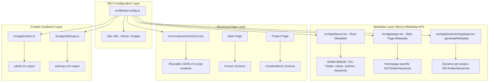

# Design Document: SEO & Twitter Cards

## Overview

This design implements comprehensive SEO improvements for the portfolio website built with Next.js 16. The implementation leverages the Next.js Metadata API (`metadata` object and `generateMetadata` function) for Open Graph, Twitter Card, and HTML meta tags. It adds JSON-LD structured data via inline `<script>` tags, a programmatic `robots.txt` via the Next.js file convention, and a dynamic XML sitemap that auto-discovers project pages.

The key design decisions are:
1. **Use Next.js built-in Metadata API** rather than manual `<meta>` tag injection — this gives us type safety, automatic merging, and proper `metadataBase` URL resolution.
2. **Centralize site configuration** in a shared constants module (`src/lib/seo-config.ts`) so that the site URL, owner name, and other SEO constants are defined once.
3. **Use the Next.js file-convention approach** for `robots.ts` and `sitemap.ts` in the `src/app/` directory, which auto-generates the respective files at build time.
4. **Render JSON-LD as a React component** following the Next.js recommended pattern of embedding `<script type="application/ld+json">` within page components.

## Architecture



### Metadata Merging Strategy

Next.js merges metadata hierarchically. Child route segments **override** parent segments for nested fields like `openGraph` and `twitter`. Our strategy:

- **Root layout** (`layout.tsx`): Sets `metadataBase`, default `title`, `description`, `openGraph` (type, siteName, image), `twitter` (card, creator), `authors`, `robots`, and default `keywords`.
- **Main page** (`page.tsx`): Exports its own `metadata` object that overrides `title`, `description`, `openGraph` (title, description, url, images), `twitter` (title, description, images), and `keywords`.
- **Project pages** (`[slug]/page.tsx`): Exports `generateMetadata` that dynamically builds metadata from frontmatter, completely overriding the parent `openGraph` and `twitter` objects.

Since Next.js does a shallow merge of nested objects (e.g., defining `openGraph` in a child replaces the parent's `openGraph` entirely), each page must re-specify all required OG/Twitter fields.

## Components and Interfaces

### 1. SEO Configuration Module

**File:** `src/lib/seo-config.ts`

Centralizes all SEO-related constants:

```typescript
export const seoConfig = {
  siteUrl: "https://akoshportfolio.vercel.app",  // Site_URL (no trailing slash)
  siteName: "Artur Koshman | Developer Portfolio",
  ownerName: "Artur Koshman",
  ownerTwitter: "@arturkoshman",
  ownerJobTitle: "Full-Stack Developer",
  defaultTitle: "Artur Koshman | Developer Portfolio",
  defaultDescription: "Portfolio of Artur Koshman — a junior full-stack developer building web and mobile applications with modern technologies.",
  defaultOgImage: "/face.png",
  ogImageDimensions: { width: 1200, height: 630 },
  socialLinks: [
    "https://github.com/sanitaravel",
    "https://linkedin.com/in/arturkoshman",
  ],
  layoutKeywords: ["developer", "portfolio", "full-stack", "software engineer", "web development"],
  mainPageKeywords: ["Next.js", "React", "Flutter", "TypeScript", "frontend", "backend"],
} as const;
```

### 2. Root Layout Metadata

**File:** `src/app/layout.tsx`

Adds a static `metadata` export using the Next.js `Metadata` type:

```typescript
import type { Metadata } from "next";
import { seoConfig } from "@/lib/seo-config";

export const metadata: Metadata = {
  metadataBase: new URL(seoConfig.siteUrl),
  title: {
    default: seoConfig.defaultTitle,
    template: `%s | ${seoConfig.ownerName}`,
  },
  description: seoConfig.defaultDescription,
  authors: [{ name: seoConfig.ownerName }],
  keywords: seoConfig.layoutKeywords,
  robots: { index: true, follow: true },
  openGraph: {
    type: "website",
    siteName: seoConfig.siteName,
    images: [{
      url: seoConfig.defaultOgImage,
      width: seoConfig.ogImageDimensions.width,
      height: seoConfig.ogImageDimensions.height,
      alt: seoConfig.ownerName,
    }],
  },
  twitter: {
    card: "summary_large_image",
    creator: seoConfig.ownerTwitter,
  },
};
```

### 3. Main Page Metadata

**File:** `src/app/page.tsx`

Adds a static `metadata` export that overrides the layout defaults:

```typescript
import type { Metadata } from "next";
import { seoConfig } from "@/lib/seo-config";

const title = "Artur Koshman — Full-Stack Developer Portfolio";
const description = "Explore projects and skills of Artur Koshman, a junior full-stack developer specializing in Next.js, React, Flutter, and TypeScript.";

export const metadata: Metadata = {
  title: { absolute: title },
  description,
  keywords: seoConfig.mainPageKeywords,
  openGraph: {
    title,
    description,
    url: seoConfig.siteUrl,
    type: "website",
    siteName: seoConfig.siteName,
    images: [{
      url: seoConfig.defaultOgImage,
      width: seoConfig.ogImageDimensions.width,
      height: seoConfig.ogImageDimensions.height,
      alt: seoConfig.ownerName,
    }],
  },
  twitter: {
    card: "summary_large_image",
    title,
    description,
    creator: seoConfig.ownerTwitter,
    images: [{
      url: seoConfig.defaultOgImage,
      width: seoConfig.ogImageDimensions.width,
      height: seoConfig.ogImageDimensions.height,
      alt: seoConfig.ownerName,
    }],
  },
};
```

### 4. Project Page Dynamic Metadata

**File:** `src/app/projects/[slug]/page.tsx`

Adds a `generateMetadata` async function that builds a dynamic OG image URL for projects without an explicit image:

```typescript
import type { Metadata } from "next";
import { seoConfig } from "@/lib/seo-config";
import { getProjectBySlug } from "@/lib/projects";

export async function generateMetadata({ params }: ProjectPageProps): Promise<Metadata> {
  const { slug } = await params;
  const project = getProjectBySlug(slug);

  if (!project) {
    return {
      title: "Not Found",
      openGraph: { images: [] },
      twitter: { images: [] },
    };
  }

  const { title, description, tags, image } = project.frontmatter;

  // Build the OG image URL: use explicit image if provided, otherwise dynamic route
  let ogImageUrl: string;
  if (image) {
    ogImageUrl = image;
  } else {
    const ogParams = new URLSearchParams({ title, description });
    if (tags.length > 0) {
      ogParams.set("tags", tags.join(","));
    }
    ogImageUrl = `${seoConfig.siteUrl}/api/og?${ogParams.toString()}`;
  }

  return {
    title,
    description,
    keywords: tags.length > 0 ? tags.join(", ") : undefined,
    openGraph: {
      title,
      description,
      url: `${seoConfig.siteUrl}/projects/${slug}`,
      type: "article",
      siteName: seoConfig.siteName,
      images: [{
        url: ogImageUrl,
        width: seoConfig.ogImageDimensions.width,
        height: seoConfig.ogImageDimensions.height,
        alt: title,
      }],
    },
    twitter: {
      card: "summary_large_image",
      title,
      description,
      creator: seoConfig.ownerTwitter,
      images: [{
        url: ogImageUrl,
        width: seoConfig.ogImageDimensions.width,
        height: seoConfig.ogImageDimensions.height,
        alt: title,
      }],
    },
  };
}
```

### 5. JSON-LD Component

**File:** `src/components/JsonLd.tsx`

A reusable component for embedding structured data:

```typescript
interface JsonLdProps {
  data: Record<string, unknown>;
}

export function JsonLd({ data }: JsonLdProps) {
  return (
    <script
      type="application/ld+json"
      dangerouslySetInnerHTML={{ __html: JSON.stringify(data) }}
    />
  );
}
```

### 6. Robots.txt

**File:** `src/app/robots.ts`

Uses the Next.js file convention for programmatic robots.txt:

```typescript
import type { MetadataRoute } from "next";
import { seoConfig } from "@/lib/seo-config";

export default function robots(): MetadataRoute.Robots {
  return {
    rules: {
      userAgent: "*",
      allow: "/",
      disallow: "/api/",
    },
    sitemap: `${seoConfig.siteUrl}/sitemap.xml`,
  };
}
```

### 7. XML Sitemap

**File:** `src/app/sitemap.ts`

Uses the Next.js file convention for dynamic sitemap generation:

```typescript
import type { MetadataRoute } from "next";
import { seoConfig } from "@/lib/seo-config";
import { getAllProjects } from "@/lib/projects";

export default function sitemap(): MetadataRoute.Sitemap {
  const projects = getAllProjects();

  const projectEntries = projects.map((project) => ({
    url: `${seoConfig.siteUrl}/projects/${project.slug}`,
    lastModified: project.frontmatter.date,
  }));

  return [
    { url: seoConfig.siteUrl, lastModified: new Date().toISOString().split("T")[0] },
    ...projectEntries,
  ];
}
```

## Data Models

### ProjectFrontmatter (Extended)

The existing `ProjectFrontmatter` interface is extended with an optional `image` field:

```typescript
export interface ProjectFrontmatter {
  title: string;
  description: string;
  tags: string[];
  date: string;
  image?: string;  // Optional project-specific OG image path
}
```

### SEO Config Type

```typescript
export interface SeoConfig {
  siteUrl: string;
  siteName: string;
  ownerName: string;
  ownerTwitter: string;
  ownerJobTitle: string;
  defaultTitle: string;
  defaultDescription: string;
  defaultOgImage: string;
  ogImageDimensions: { width: number; height: number };
  socialLinks: string[];
  layoutKeywords: string[];
  mainPageKeywords: string[];
}
```

### Person Schema (JSON-LD)

```typescript
interface PersonSchema {
  "@context": "https://schema.org";
  "@type": "Person";
  name: string;
  url: string;
  jobTitle: string;
  sameAs: string[];
}
```

### CreativeWork Schema (JSON-LD)

```typescript
interface CreativeWorkSchema {
  "@context": "https://schema.org";
  "@type": "CreativeWork";
  name: string;
  description: string;
  dateCreated: string;
  keywords: string[];
  author: {
    "@type": "Person";
    name: string;
  };
}
```


## Correctness Properties

*A property is a characteristic or behavior that should hold true across all valid executions of a system — essentially, a formal statement about what the system should do. Properties serve as the bridge between human-readable specifications and machine-verifiable correctness guarantees.*

### Property 1: Project metadata faithfully maps frontmatter fields

*For any* valid project frontmatter (with non-empty title, non-empty description, valid date, and any tags array), calling the project metadata generation function SHALL produce metadata where:
- `openGraph.title` equals the frontmatter `title`
- `openGraph.description` equals the frontmatter `description`
- `twitter.title` equals `openGraph.title`
- `twitter.description` equals `openGraph.description`
- `twitter.card` equals `"summary_large_image"`
- `openGraph.url` equals `${siteUrl}/projects/${slug}` with no trailing slash
- `keywords` equals `tags.join(", ")` when tags is non-empty, or is undefined when tags is empty

**Validates: Requirements 3.1, 3.2, 3.3, 3.4, 5.2, 11.3, 11.4**

### Property 2: Project metadata image handling with correct dimensions

*For any* valid project frontmatter, the generated metadata SHALL include image entries in both `openGraph.images` and `twitter.images` where:
- If frontmatter has no `image` field, the image URL is a dynamic OG image URL pointing to `/api/og` with encoded query parameters (see Property 6)
- If frontmatter has an `image` field, the image URL matches that field's value
- Every image entry has `width` equal to 1200 and `height` equal to 630
- Every image entry has a non-empty `alt` attribute equal to the frontmatter `title`

**Validates: Requirements 3.5, 3.6, 6.1, 6.2, 6.3, 13.1, 13.3**

### Property 3: CreativeWork schema correctly maps frontmatter

*For any* valid project frontmatter, constructing the CreativeWork JSON-LD schema SHALL produce an object where:
- `@context` equals `"https://schema.org"`
- `@type` equals `"CreativeWork"`
- `name` equals the frontmatter `title`
- `description` equals the frontmatter `description`
- `dateCreated` equals the frontmatter `date` in YYYY-MM-DD format
- `keywords` is an array equal to the frontmatter `tags`
- `author` is an object with `@type` equal to `"Person"` and `name` equal to the configured owner name

**Validates: Requirements 8.1, 8.2, 8.3, 8.4, 8.5, 8.6**

### Property 4: JSON-LD output is always valid parseable JSON

*For any* valid project frontmatter (including titles and descriptions with special characters such as quotes, backslashes, angle brackets, and unicode), serializing the CreativeWork schema with `JSON.stringify` SHALL produce output that `JSON.parse` can parse without throwing an error, and the parsed result SHALL be deeply equal to the original schema object.

**Validates: Requirements 7.5, 8.8**

### Property 5: Sitemap includes all valid projects with correct URLs and dates

*For any* set of valid projects (each with a unique slug and a valid YYYY-MM-DD date), the sitemap generation function SHALL return an array where:
- There is exactly one entry with `url` equal to the site URL (main page entry)
- For each project, there is exactly one entry with `url` equal to `${siteUrl}/projects/${slug}`
- Each project entry has `lastModified` equal to the project's frontmatter `date`
- The total number of entries equals the number of projects plus one (for the main page)

**Validates: Requirements 10.3, 10.4, 10.6, 10.7**

### Property 6: Dynamic OG image URL construction for project pages

*For any* valid project frontmatter without an explicit `image` field, the generated metadata SHALL produce identical OG and Twitter image URLs that:
- Are absolute URLs beginning with the configured site URL
- Contain the path `/api/og`
- Include a `title` query parameter equal to the frontmatter title (URL-encoded)
- Include a `description` query parameter equal to the frontmatter description (URL-encoded)
- Include a `tags` query parameter equal to the frontmatter tags joined by commas (URL-encoded) when tags are non-empty
- Do NOT include a `tags` parameter when frontmatter tags array is empty

And *for any* valid project frontmatter WITH an explicit `image` field, the generated metadata SHALL use that image value directly for both OG and Twitter image URLs, without referencing the `/api/og` route.

**Validates: Requirements 13.1, 13.2, 13.3, 13.4**

## Components and Interfaces (Continued — Dynamic OG Image)

### 8. Dynamic OG Image API Route

**File:** `src/app/api/og/route.tsx`

Generates Open Graph images dynamically using `ImageResponse` from `next/og` (built into Next.js). The route accepts query parameters and renders a branded image using Satori's flexbox-based layout engine.

```typescript
import { ImageResponse } from "next/og";
import { NextRequest } from "next/server";

export const runtime = "edge";

export async function GET(request: NextRequest) {
  const { searchParams } = request.nextUrl;
  const title = searchParams.get("title");
  const description = searchParams.get("description") || "";
  const tags = searchParams.get("tags")?.split(",").filter(Boolean) || [];

  // Fallback: redirect to static image when title is missing
  if (!title) {
    return Response.redirect(new URL("/face.png", request.url));
  }

  try {
    return new ImageResponse(
      (
        <div
          style={{
            display: "flex",
            flexDirection: "column",
            justifyContent: "center",
            padding: "60px",
            width: "100%",
            height: "100%",
            backgroundColor: "#0f0f0f",
            color: "#f5f5f5",
          }}
        >
          {/* Title */}
          <div
            style={{
              fontSize: 48,
              fontWeight: 700,
              lineHeight: 1.2,
              marginBottom: 20,
            }}
          >
            {title}
          </div>

          {/* Description (conditional) */}
          {description && (
            <div
              style={{
                fontSize: 24,
                color: "#a0a0a0",
                lineHeight: 1.4,
                marginBottom: 24,
                overflow: "hidden",
                textOverflow: "ellipsis",
                display: "-webkit-box",
                WebkitLineClamp: 3,
                WebkitBoxOrient: "vertical",
              }}
            >
              {description}
            </div>
          )}

          {/* Tags (conditional) */}
          {tags.length > 0 && (
            <div style={{ display: "flex", flexWrap: "wrap", gap: "8px" }}>
              {tags.map((tag) => (
                <div
                  key={tag}
                  style={{
                    fontSize: 16,
                    backgroundColor: "#2a2a2a",
                    color: "#60a5fa",
                    padding: "6px 14px",
                    borderRadius: "6px",
                  }}
                >
                  {tag.trim()}
                </div>
              ))}
            </div>
          )}
        </div>
      ),
      {
        width: 1200,
        height: 630,
      }
    );
  } catch {
    // Fallback on any rendering error
    return Response.redirect(new URL("/face.png", request.url));
  }
}
```

**Key design decisions:**
- **Edge runtime** — `ImageResponse` from `next/og` runs on the edge for fast response times.
- **Satori layout** — Uses a subset of CSS (flexbox only, no Grid) with inline styles. Satori doesn't support Tailwind classes.
- **Dark theme** — Background `#0f0f0f` matches the portfolio's dark theme. Text is `#f5f5f5` for contrast. Tags use accent blue `#60a5fa`.
- **Dimensions** — Fixed 1200×630 matching standard OG image dimensions.
- **Fallback** — On missing title or any render error, redirects to `/face.png` rather than returning an error status.
- **Title font 48px** (≥40px requirement), **description 24px** (≥20px requirement).

### 9. Project Page Dynamic OG Image URL (Updated generateMetadata)

**File:** `src/app/projects/[slug]/page.tsx`

> Note: This section documents the same `generateMetadata` function shown in Section 4 above. The key change from the original design is that projects without an explicit `image` field now use the dynamic `/api/og` route instead of falling back to the static `/face.png`.

**Key changes from previous design:**
- When frontmatter has no `image` field, the OG image URL is now `${siteUrl}/api/og?title=...&description=...&tags=...` instead of the static `/face.png`.
- When frontmatter includes an `image` field, that value is used directly (preserving Requirement 13.3).
- The URL is always absolute (using `seoConfig.siteUrl` as base).
- Both `openGraph.images` and `twitter.images` use the same URL.

### 10. Dynamic OG Image Visual Layout Template

The generated image follows this visual structure:

```
┌──────────────────────────────────────────────────────────────┐
│  (60px padding all around)                                    │
│                                                               │
│  ┌─────────────────────────────────────────────────────────┐ │
│  │  PROJECT TITLE                                          │ │
│  │  (48px, bold, white #f5f5f5, max 2 lines)              │ │
│  └─────────────────────────────────────────────────────────┘ │
│                                                               │
│  ┌─────────────────────────────────────────────────────────┐ │
│  │  Description text here, truncated with ellipsis if too  │ │
│  │  long. Maximum 3 lines displayed...                     │ │
│  │  (24px, gray #a0a0a0, max 3 lines with overflow hidden)│ │
│  └─────────────────────────────────────────────────────────┘ │
│                                                               │
│  ┌────────┐ ┌────────┐ ┌────────┐                           │
│  │  Tag1  │ │  Tag2  │ │  Tag3  │  ...                      │
│  └────────┘ └────────┘ └────────┘                           │
│  (16px, blue #60a5fa on dark #2a2a2a, rounded badges)        │
│                                                               │
│  Background: #0f0f0f (dark, matches portfolio theme)          │
└──────────────────────────────────────────────────────────────┘
                        1200 × 630 px
```

**Style specifications:**
| Element     | Font Size | Color     | Weight | Additional                     |
|-------------|-----------|-----------|--------|--------------------------------|
| Title       | 48px      | #f5f5f5   | 700    | Line height 1.2, max ~2 lines |
| Description | 24px      | #a0a0a0   | 400    | Line height 1.4, max 3 lines, ellipsis overflow |
| Tags        | 16px      | #60a5fa   | 400    | Background #2a2a2a, padding 6px 14px, border-radius 6px |
| Background  | —         | #0f0f0f   | —      | Full 1200×630 area             |

**Conditional rendering:**
- Description section is omitted entirely when `description` param is empty/missing.
- Tags section is omitted entirely when `tags` param is empty/missing.
- Title is always required (fallback triggers without it).

## Error Handling

### Dynamic OG Image Route Errors
When the `/api/og` route encounters issues:
- **Missing title parameter:** Redirects (302) to `/face.png`. This ensures that even malformed URLs produce a valid image rather than a broken preview.
- **Rendering error:** If `ImageResponse` throws (e.g., due to invalid JSX or Satori failure), the catch block redirects to `/face.png`. This guarantees social platforms always receive a valid image response.
- **Missing description/tags:** These are optional — the route renders without those sections. No error is triggered.

### Non-Existent Project Slug
When `generateMetadata` is called with a slug that doesn't match any project:
- Return metadata with title `"Not Found"` 
- Set `openGraph.images` and `twitter.images` to empty arrays to prevent inherited images from appearing
- Omit `openGraph.description` and `twitter.description`
- Omit `openGraph.url`
- Do NOT render a JSON-LD script tag

This ensures that 404 pages don't inherit misleading social preview data from the root layout.

### Invalid Frontmatter
The existing `validateFrontmatter` function already filters out invalid projects. Invalid projects are skipped by `getAllProjects()` and will not appear in:
- The sitemap
- The project routing (generateStaticParams)
- Any metadata generation

### Empty Projects Directory
If no valid project markdown files exist:
- `getAllProjects()` returns an empty array
- The sitemap still produces a valid XML document with only the main page entry
- No project-related structured data is generated

### Special Characters in Frontmatter
JSON-LD generation uses `JSON.stringify()` which properly escapes special characters (quotes, backslashes, control characters). No additional sanitization is needed for the structured data output.

## Testing Strategy

### Unit Tests (Example-Based)

Focus on static configuration correctness and specific edge cases:

1. **Root layout metadata** — Verify all required fields are present: metadataBase, openGraph (type, siteName, images), twitter (card, creator), authors, robots, keywords
2. **Main page metadata** — Verify title/description differ from defaults, character limits, OG/Twitter consistency, image alt text
3. **Not-found handling** — Verify generateMetadata returns correct structure for non-existent slugs
4. **Person schema** — Verify all required fields present with correct values, no null/undefined values, sameAs URLs valid
5. **Robots.txt** — Verify robots() function output contains correct directives
6. **Sitemap edge cases** — Verify behavior with zero projects
7. **OG route dimensions** — Verify ImageResponse is constructed with width=1200, height=630
8. **OG route content type** — Verify response Content-Type is `image/png`
9. **OG route fallback (missing title)** — Verify redirect to `/face.png` when title param is absent or empty
10. **OG route fallback (error)** — Mock a rendering error, verify redirect to `/face.png`
11. **OG route optional params** — Verify image renders without description/tags when those params are missing
12. **OG route visual config** — Verify title font ≥ 40px, description font ≥ 20px, dark background, light text
13. **Main page preserves static image** — Verify main page metadata uses `/face.png`, not the dynamic OG route

### Property-Based Tests (fast-check)

Each property test runs a minimum of 100 iterations with randomly generated frontmatter data:

1. **Property 1 test** — Generate random valid ProjectFrontmatter objects (random titles, descriptions, dates, tags, slugs), call the metadata generation logic, assert all field mappings hold
2. **Property 2 test** — Generate random frontmatter with and without `image` field, verify image handling invariants
3. **Property 3 test** — Generate random frontmatter, build CreativeWork schema, verify all field mappings
4. **Property 4 test** — Generate frontmatter with adversarial strings (unicode, quotes, HTML entities, newlines), verify JSON round-trip
5. **Property 5 test** — Generate random sets of projects (varying count 0-20, random slugs and dates), call sitemap logic, verify completeness
6. **Property 6 test** — Generate random frontmatter with and without `image` field, call the updated metadata generation logic, verify dynamic OG URL construction (includes correct base URL, path, and encoded query params) or explicit image override

**Property test library:** `fast-check` (already installed in devDependencies)

**Configuration:** Each property test uses `fc.assert(fc.property(...), { numRuns: 100 })` minimum.

**Tag format:** Each test includes a comment: `// Feature: seo-twitter-cards, Property {N}: {property_text}`

### Integration Tests

Not needed for this feature — all functionality is testable via unit and property tests against the exported functions. The Next.js framework handles the actual HTTP serving of robots.txt, sitemap.xml, and the OG image route. The `ImageResponse` rendering itself is tested via unit tests that verify the response object properties (status, headers, dimensions).
